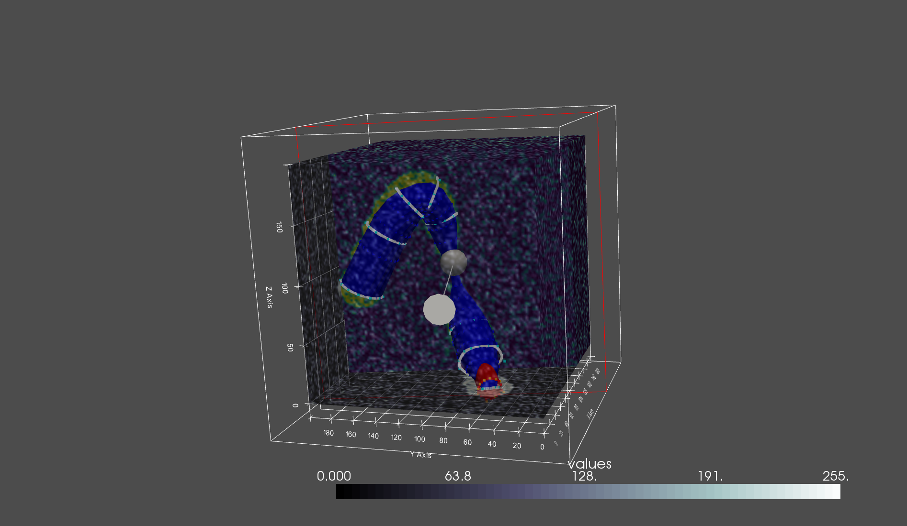

# BSpline_Active_Contour
 2D and 3D Active contours using BSplines
 
## About

 This project was built as part of my masters thesis at University
 College London.
 
 The code is free to be used, modified, and distributed as per the MIt license.
 
 This is far from a finished product, and some of the classes included have
 shown very limited results. This repository is here so other can review and
 potentially build upon this current implementation.
 
 The paper will be added to this repository as a file or a link at a future 
 date.

## Hybrid Snakes

 The main output of this dissertation is a hybrid snake which solves the
 contour problem across 2D slices but then extrapolates the results to 3D.

 To use hybrid snakes, simply initialize the input spline:
 
```
 # Set input spline geometry
x = [50, 50, 50]
y = [50, 50, 50]
z = np.linspace(0, 99, 3)
array = np.stack([x, y, z])
```
 
 Start by loading your wanted file or file directory (don't forget
 the trailing slash so it recognizes directories, the string may need to be raw bytes).

```
# Import the data
file = "testfiles/spline_tube_dataset_noisy.gif"
imseq = ImageSequence(file)
imseq.change_resolution((200, 200, 200))
```
 
 Now initialize the solver with the image sequence, the spline input, and other parameters you may want to include.

 The value "n" is the number of slices, plane extent and shape are how large
 the planes are, and the resolution in the plane's x/y coordinates.
 
 Other values can be passed to the solver
```
# Create a bspline hybrid solver
hs_bspl = HybridSnakes(imseq, array,                  
                  plane_extent = (100, 100),
                  plane_shape = (100, 100),
                  n=6,
                  snake_type = 'bspline'
                  )
```

The default parameters are:

```
# interpolation
fill_value = 0

# slicing
plane_shape = (100, 100)
plane_extent = (100, 100)

# input snake geometry
init_spline_size = 20
num_points = 50

# snake type
snake_type = 'active_contour'
gaussian_smoothing = 3

# active contour parameters
active_contour_options = {
    "alpha": -0.015,
    "beta": 100,
    "gamma": 1E-2,
    "w_edge": 1E6,
    "max_iterations": 10000,
    "boundary_condition": "periodic",
    "convergence": 0.01,
}

# BSpline Snakes
bsnake_opts = {'maxiter': 50, 'disp': True, 'gtol': 1E-2}
bsnake_opts_tol = 1E-5
bsnake_num_ctrlpts = 10
bsnake_lambda = [1E-2, 1E-5]
```

 Once you have chosen your parameters (the default ones are the ones I had the most success with when testing across datasets), you can optimize the slices:

```
# %% optimize along slices
snakes = hs_bspl.optimize_slices()
```

 And plot:
 
```
hs_bspl.plot(plane_widget=True)
```


 
## Other 3D solvers
 Examples are included for all the solvers considered in the "examples" folder. These were not as successful and in the case of the force analog model is simply not behaving the way I would like it to. These are still included in the examples, but expect limited results.